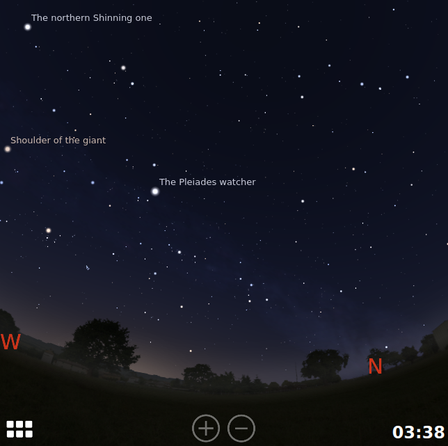
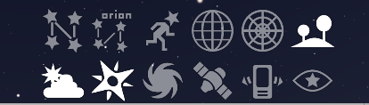
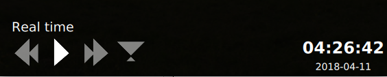
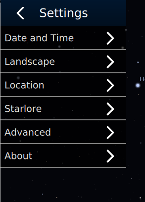
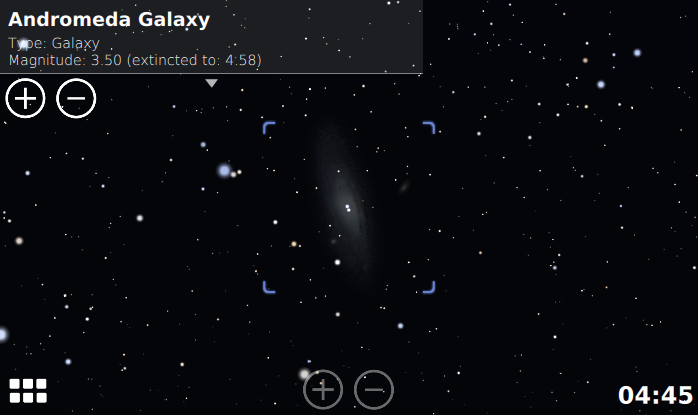

Introduction
------------

Stellarium Mobile is a planetarium application for Android and iOS. It shows a
realistic sky in 3D, just like what you see with the naked eye, binoculars or a
telescope. It features an intuitive touch-screen-friendly user interface and
allows GPS positioning and accelerometers control. This project is based on a
highly-optimized version of the desktop software [Stellarium] and is developed
by its original creator.

[Stellarium]: http://stellarium.org

\pagebreak

Overview
--------

\Begin{multicols}{2}

{width=45%}\

Once started the program will display the sky at the current time and current
location. Basic navigation is achieved by panning the view with your fingers,
and zooming in and out using a pinch gesture.  The two most useful GUI elements
are the Quick Bar which can be opened by tapping on the bottom left corner
button, and the Time Bar which can be opened by tapping on the date in the
bottom right corner.

It is also possible to zoom using the two zoom buttons at the bottom center
of the screen.

\End{multicols}

The Quick Bar
-------------

\Begin{multicols}{2}

{width=48%}\

It gives quick access to the most useful buttons for displaying/hiding sky
elements, searching object, activating accelerometers control or for
displaying/hiding the main menu. Keeping the finger pressed on a button
will display its function.

When the Quick bar is open, it also shows a search input at the top of the
screen that we can use to search for astronomy objects by name.

The buttons available in the quick bar are:

Constellations:
  ~ Toggle the constellation lines on and off.

Constellation Names:
  ~ Toggle the constellation names on and off.

Constellation Art:
  ~ Toggle the constellation images on and off.

Equatorial Grid:
  ~ Toggle the equatorial grid on and off.

Azimuthal Grid:
  ~ Toggle the azimuthal grid on and off.

Landscape:
  ~ Toggle the visibility of the landscape.

Atmosphere:
  ~ Toggle the visibility of the atmosphere.  If the atmosphere is off, the
    light refraction effect is not applied.

Cardinal Points:
  ~ Toggle the four cardinal points symbols (N, S, E, W).

Deep Sky Objects:
  ~ Toggle markers for the nebulae and other deep sky objects that are too
    faint to be visible.

Satellites:
  ~ Toggle markers for the artificial satellites positions.

Sensors:
  ~ Toggle the sensor mode.  When the sensor mode is on, the view moves in
    augmented reality mode, following the actual direction of the phone.
    This allows to point at an actual object in the sky and see what it
    is on the phone.

Night mode:
  ~ Toggle night mode.  In night mode a red blending effect is applied to the
    screen so that we can use the application in the night without losing
    our night vision.

In order to close the Quick Bar, just press once anywhere in the sky.

\End{multicols}

\pagebreak

The Time Bar
-------------

\Begin{multicols}{2}

{width=48%}\

We can open the time bar by pressing the time at the bottom right corner of
the screen.

It contains buttons for reverse and fast forwarding in time. When displayed, it
also activates the time dragging mode, i.e. dragging the sky with the finger,
will "move the time" instead of moving the direction of view. This way of
interacting with time gives you the amazing feeling of controlling the earth
rotation on his axis with just one finger!

To close the time bar, press a single time anywhere on the screen.

\End{multicols}

Settings
--------

\Begin{multicols}{2}

{width=48%}\

We can access the settings menu from the Quick Bar, by pressing the left
'hamburger' icon.  A menu appears with different items, each of them
opening a specific dialog:

Date and Time:
  ~ Allow to set the time.  By default Stellarium Mobile uses the actual
    time, but this can be useful to go to a specific time.  From there we
    can also configure whether the program will automatically advance the
    time if started during daytime.

Landscape:
  ~ Landscape selection dialog, with various images of Earth or solar system
    locations

Location:
  ~ Location dialog.  See the location section for more info.

Starlore:
  ~ Allow to select what sky culture to use for the stars and constellations.

Advanced:
  ~ A few advanced options:

    - Show planet markers.
    - Show ecliptic lines.
    - Show meridian lines.
    - Show constellation boundaries.
    - Set light pollution.
    - Set the Milky Way brightness
    - Set the thickness of the constellation lines.
    - Reset all settings.

About:
  ~ Show information about the current version of Stellarium Mobile.

\End{multicols}

\pagebreak

Location Dialog
---------------

\Begin{multicols}{2}

{width=48%}\

The location dialog controls how you set your location, so that the position of
the stars in the program correspond to the actual stars in the sky.

By default the program will try to use your GPS location, as given by your
phone.  If you want to set the location manually, you have to first uncheck
the 'Use GPS' checkbox, and select from the two methods:

- By setting the latitude and longitude directly.
- By selecting a city in a predefined list.

It is also possible to click on the world map to directly move to a given
location, though the precision will then be poor.

\End{multicols}

Object selection
----------------

\Begin{multicols}{2}

{width=48%}\

Tapping on an object in the sky will display a context menu in the top left
corner, allowing to center the view on the object, automatically zoom in or
out, and display information about its position or magnitude (brightness). To
unselect the object, tap on the object's name.

\End{multicols}

More Info
---------

Please refer to <https://noctua-software.com/stellarium-mobile> for more
information about this application.
